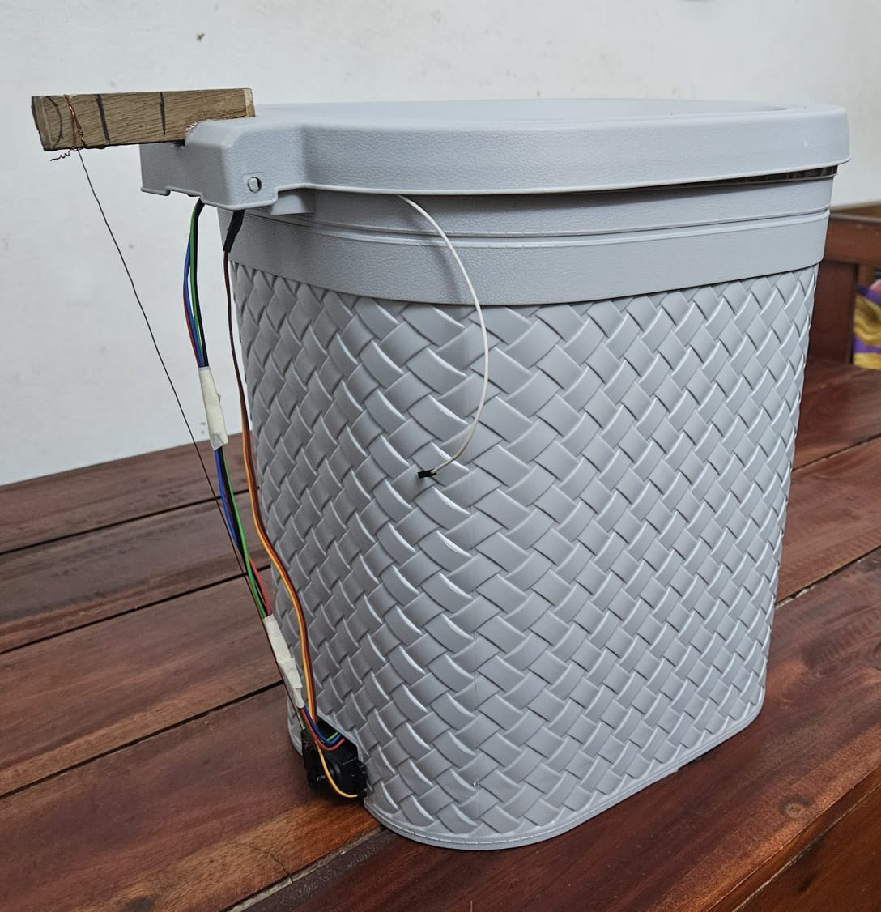

# SmartBin Project

## Images
Below are the images related to the project:

*Front setup of the SmartBin.*

*The mechanism behind the SmartBin.*

*Circuit setup of the SmartBin.*

*The Blynk app interface for monitoring the SmartBin.*

## Description
This project implements a **Smart Bin** using an **ESP32** with **ultrasonic sensors**, a **smoke sensor**, and a **servo motor**. The system is controlled and monitored through the **Blynk app**. The bin opens automatically when an object is detected, and the lid closes slowly when no object is present. It also detects the fill level and the smoke level inside the bin, sending the data to the Blynk app for remote monitoring.

## Features:
- **Ultrasonic Sensors**: Measure the distance between the sensor and the object in front of the bin.
- **Servo Motor**: Opens and closes the bin lid based on the presence of an object.
- **Smoke Sensor**: Monitors the smoke level inside the bin and triggers an alert if necessary.
- **Blynk IoT Integration**: Sends the fill level and smoke data to the Blynk app.

## Hardware Requirements:
- **ESP32** board
- **Ultrasonic Sensors** (HC-SR04 or similar)
- **Servo Motor** (for lid control)
- **MQ-2/MQ-135 Smoke Sensor**
- **Buzzer** (for smoke alerts)
- **Power Supply** (for ESP32 and other components)

## Software Requirements:
- **Arduino IDE** for uploading the code to the ESP32
- **Blynk app** for remote monitoring and control

## Installation:
1. Clone this repository to your local machine
2. Open the project in Arduino IDE.
3. Install the Blynk library and ESP32 board package if not already installed.
4. Connect the ESP32 to your computer and upload the code.
5. Set up the Blynk app using the provided auth token.
6. Power the ESP32 and monitor it via the Blynk app.

## Wiring:
Ultrasonic Sensor 1 (Front):

Trig Pin: GPIO 5
Echo Pin: GPIO 18
Ultrasonic Sensor 2 (Inside Bin):

Trig Pin: GPIO 12
Echo Pin: GPIO 13
Servo Motor:

Control Pin: GPIO 33
Smoke Sensor (MQ-2/MQ-135):

Analog Pin: GPIO 34
Buzzer:

Pin: GPIO 15

## Code Overview:
The code integrates sensors with the ESP32 and controls the servo motor based on the object detection from the ultrasonic sensor. The bin’s fill level and smoke levels are sent to the Blynk app for remote monitoring.

## Example Code:
You can find the full Arduino code in the repository. The code handles:

Object detection via ultrasonic sensors.
Servo control to open and close the bin lid.
Smoke detection and alert via the Blynk app.

## License:
This project is licensed under the MIT License - see the LICENSE file for details.
